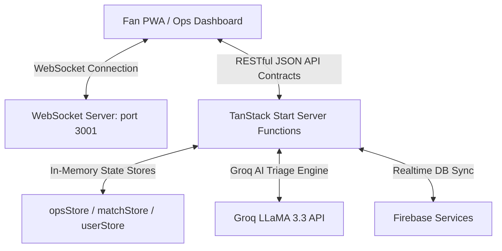
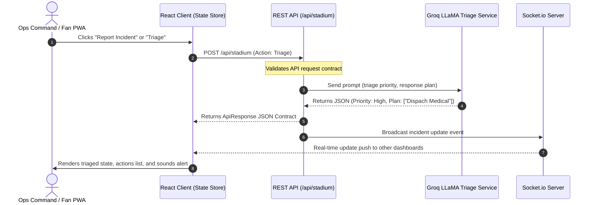

# FanOps Unified — System Architecture

This document details the system design, component hierarchy, data flow pathways, and state management patterns of the FanOps Unified platform for the FIFA World Cup 2026.

---

## 🏗️ System Design Overview

FanOps Unified is built on **TanStack Start**, a full-stack React framework powered by **Vite** and **Nitro**. The application combines the speed of Server-Side Rendering (SSR) with client-side interactivity, connected to a local memory cache store and live mock databases (simulating high-throughput World Cup stadium operations).

---

## 📊 Core State Management (Client-Side Stores)

Client-side state is managed using **Zustand** stores designed for extreme latency tolerance and offline-first usage during live matches:

### 1. Operations Store (`opsStore.ts`)

- Manages real-time incident queues (reported, triaged, resolved).
- Manages stadium zones layout status (Gate A, B, C, D) and congestion alerts.
- **Hook selectors**: `useIncidents`, `useZones`, `useIncidentsByStatus`, `useCriticalZones`.

### 2. Match Scoreboard Store (`matchStore.ts`)

- Manages active matches, live scoreboard updates (goals, cards, timers), and team stats.
- **Hook selectors**: `useActiveMatch`, `useMatchStats`.

### 3. User Persona Store (`userStore.ts`)

- Manages the selected user profile (Fan, Ops, Volunteer) and authentication profiles.
- **Hook selectors**: `useUserProfile`, `useUserRole`.

---

## 🔄 Live Data Flow Diagrams

### 1. Incident Reporting and AI Triage Flow

---

## 📡 RESTful API Route Contracts

All REST routes are under `src/routes/api/` and conform to the contract: `{ success: boolean, data: T | null, error: string | null }`.

### 1. System Health Endpoint (`/api/healthz`)

- **Method**: `GET`
- **Response**: Simple uptime and system checks.

### 2. System Performance Metrics (`/api/system`)

- **Method**: `GET`
- **Response**: Live server uptime, active memory usage, and socket client counts.

### 3. Stadium Action Dispatcher (`/api/stadium`)

- **Method**: `POST`
- **Actions**:
  - `triage`: Automatically triages an incident card using Groq AI LLaMA.
  - `route`: Evaluates evacuation or accessibility pathways during gate blockages.
  - `density`: Refreshes zone load ratios.

### 4. Groq Assistant Interface (`/api/assistant`)

- **Method**: `POST`
- **Response**: Answers stadium operations questions using specialized personas.
